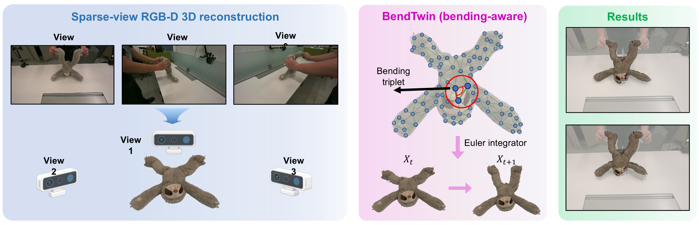

<h1 align="center">
  <i>BendTwin: Robust Dense-to-Sparse Physical Reconstruction with Bending-Aware Differentiable Spring-Mass Models</i>
</h1>

<h2 align="center">
  NeurIPS 2026 Workshop <i>Oral</i>
</h2>

<p align="center">
  Yixiong Jing · Qi Wang · Lin Chen · Junwei Jiang · Guangming Wang · Haibing Wu · Olaf Wysocki · Wanli Ma · Brian Sheil
</p>

<p align="center">
  <a href="https://qiwang067.github.io/bendtwin"></a>
  <a href="https://arxiv.org/pdf/2608.06164"></a>
</p>

<p align="center">
  <a href="https://qiwang067.github.io/bendtwin"><b>🌐 Website</b></a> ·
  <a href="https://arxiv.org/pdf/2608.06164"><b>📑 arXiv</b></a> ·
  <a href="#quick-start"><b>⚡ Quick Start</b></a> ·
  <a href="#training-and-inference"><b>🏋️ Training</b></a> ·
  <a href="#evaluation"><b>📊 Evaluation</b></a> 
</p>

<p align="center">
  
</p>


Reconstructing objects with mechanical properties from video observations enables physically consistent dynamic prediction, benefiting robotics planning and interaction. Existing spring--mass based physical driven reconstruction approaches offer efficient and differentiable physical reconstruction, but they typically rely on axial springs alone. Such formulations oversimplify the underlying structural mechanics and can become mechanically under-constrained when the physical graph is coarsened, limiting their ability to preserve stable local deformation. We present BendTwin, a bending-aware differentiable spring--mass framework for video-based reconstruction and future prediction of deformable objects. BendTwin introduces bending stiffness and damping over local surface triplets, penalizing deviations from rest angles and regularizing higher-order deformation. These bending constraints improve mechanical stability while preserving the simplicity of spring--mass system. Experiments show that BendTwin consistently outperforms the axial-only PhysTwin baseline in reconstruction & re-simulation and future prediction. Ablation studies further demonstrate that the bending constraints maintain system stability across different downsampling ratios and consistently improve upon the original PhysTwin formulation. Overall, BendTwin provides an effective approach for constructing mechanically faithful digital twins from sparse-view RGB-D videos.


## Repository Structure

```text
bendtwin/
├── configs/                         # Simulation and optimization settings
├── data_process/                    # Segmentation, tracking, alignment, and point clouds
├── env_install/                     # Linux environment and model download scripts
├── gaussian_splatting/              # Static and dynamic Gaussian rendering
├── qqtt/
│   ├── data/                        # Processed real-data loaders
│   ├── engine/                      # Training and CMA-ES optimization engines
│   └── model/diff_simulator/        # Bending-aware Warp spring-mass simulator
├── process_data.py                  # Single-case data processing
├── optimize_cma.py                  # Single-case zero-order optimization
├── train_warp.py                    # Single-case differentiable optimization
├── inference_warp.py                # Single-case inference
├── script_*.py                      # Multi-case pipeline entry points
├── run_all.sh                       # End-to-end train/evaluation pipeline
└── interactive_playground.py        # Interactive simulation and rendering
```

## Quick Start

### Requirements

The code is designed for Linux with an NVIDIA GPU. The provided setup uses Python 3.10 and CUDA 12.x.

```bash
conda create -y -n bendtwin python=3.10
conda activate bendtwin

# Example for CUDA 12.1
export PATH=/path/to/cuda-12.1/bin:$PATH
export LD_LIBRARY_PATH=/path/to/cuda-12.1/lib64:$LD_LIBRARY_PATH

bash ./env_install/env_install.sh
bash ./env_install/download_pretrained_models.sh
```

For an RTX 5090 with CUDA 12.8, use the dedicated installer:

```bash
export PATH=/path/to/cuda/bin:$PATH
export LD_LIBRARY_PATH=/path/to/cuda/lib64:$LD_LIBRARY_PATH
export CUDA_HOME=/path/to/cuda
bash ./env_install/5090_env_install.sh
bash ./env_install/download_pretrained_models.sh
```


### Dataset

Download the dataset:
- [data](https://huggingface.co/datasets/Jianghanxiao/PhysTwin/resolve/main/data.zip): this includes the original data for different cases and the processed data for quick run. The different case_name can be found under `different_types` folder.

## Training and Inference

### End-to-End Pipeline

`run_all.sh` is the main launcher. Its first three positional arguments are the surface sampling ratio, object sampling ratio, and GPU index:

```bash
# Full optimization, training, inference, rendering, and evaluation.
bash run_all.sh 1.0 1.0 0 --mode all <scene_1> <scene_2>

# Training stages only.
bash run_all.sh 1.0 1.0 0 --mode train <scene_name>

# Evaluation only, using existing outputs.
bash run_all.sh 1.0 1.0 0 --mode eval <scene_name>
```


### Run Stages Separately

```bash
# Stage 1: zero-order parameter initialization.
python script_optimize.py \
  --surface_sample_ratio 1.0 \
  --obj_sample_ratio 1.0 \
  --scenes <scene_name> \
  --gpu 0

# Stage 2: differentiable first-order optimization.
python script_train.py \
  --surface_sample_ratio 1.0 \
  --obj_sample_ratio 1.0 \
  --scenes <scene_name> \
  --gpu 0

# Inference with the recovered model.
python script_inference.py \
  --surface_sample_ratio 1.0 \
  --obj_sample_ratio 1.0 \
  --scenes <scene_name> \
  --gpu 0

# Train the first-frame Gaussian appearance model.
bash gs_run.sh
```

## Evaluation

Render reconstructed dynamics from the original viewpoints and compute quantitative metrics:

```bash
bash gs_run_simulate.sh
python export_render_eval_data.py
bash evaluate.sh

# White-background qualitative renderings.
bash gs_run_simulate_white.sh
python visualize_render_results.py
```


## Credits

The codes refer to the implemention of [PhysTwin](https://github.com/jianghanxiao/phystwin). Thanks for the authors!

## License

See [LICENSE](./LICENSE) for details.
